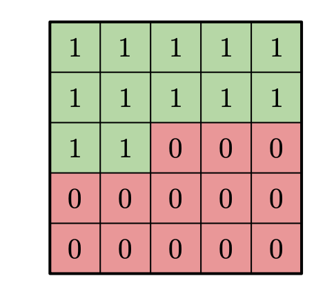
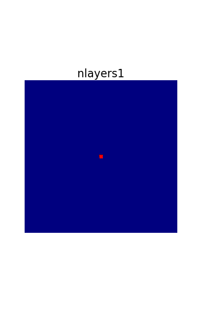
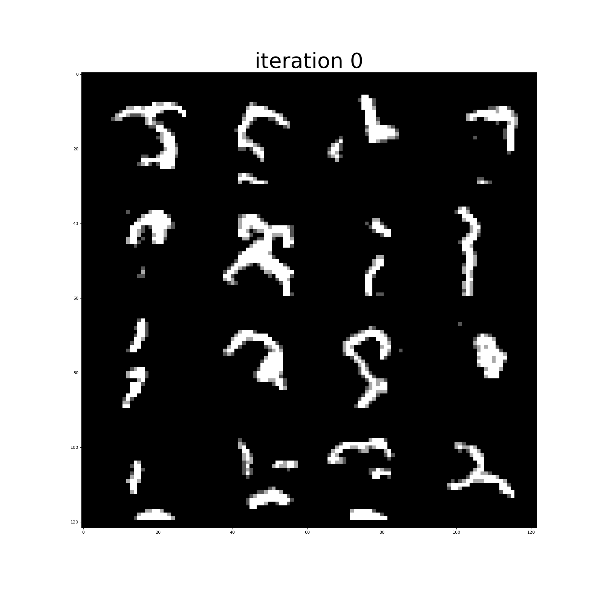

# PixelCNN

PixelCNN [(van den Oord et al)](https://arxiv.org/pdf/1606.05328.pdf) is an autoregresive model where we try to model the distribution of the data  ) 

  is typically a vector in , and it can be an image, a sequence of words or any other signal.
By the product rule of probability we have =p(x_1)p(x_2|x_1)\dots&space;p(x_n|x_{n-1}\dots&space;x_2,x_1)).
This is true for any ordering of the elements in the vector. 
As can be seen from the equation, in order to build this model we need the elements of the vector to be dependent only on the previous elements; again for any ordering. For images here we use raster scan ordering. To do this, the paper [Pixel Recurrent Networks](https://arxiv.org/pdf/1601.06759.pdf) proposed to mask the weights of the convolutions in order to limit the Receptive Field (RF) of the network in such a way that the dependencies mentioned are satisfied. The following mask in principle can limit the RF:

However this mask has a blindspot, that means that even though the output doesn't see future pixels, it fails to use some of the previous ones.
To solve this issue, the authors proposed to use two streams of masked convolutions, one in charge of the previous row (called vertical stream) and one to deal with the previous pixels in the current row (called horizontal stream). The following animation shows how the RF grows in both cases (with and w/o blind spots). This animation was generated using my code to compute RF which is available in [this repository](https://github.com/rogertrullo/Receptive-Field-in-Pytorch).

  

In this repository I present my own implementation of the GatedPixelCNN framework which does not have any blind spot. Below are some samples obtained from the model when trained on MNIST:

 

